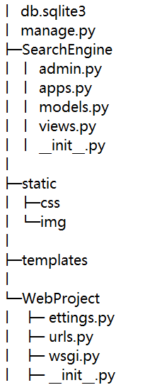
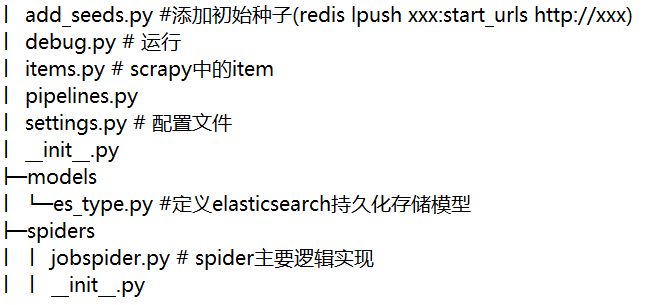

### Project Introduction
* 项目整体分为scrapy-redis分布式爬虫爬取数据、基于ElasticSearch数据检索和前端界面展示三大模块。做此项目是为了熟悉scrapy-redis的基本流程，以及其背后的原理，同时熟悉ElasticSearch的使用。本项目可以作为一个基于ES存储的简单但是相对全面的全栈开发的Demo。项目中所采用的组件均在win10本地环境搭建（伪分布），旨在演示项目流程。你可以参考该项目，并将其扩展到多个主机上，实现分布式ES以及分布式Scrapy。
 
* 项目涉及很多内容，鉴于篇幅有限，不便展开。本文尽可能清晰的说明项目框架、运行流程以及可能出现的问题。但是，相信你一定会遇到其他困难，你需要查阅文档(文末列出部分参考文档)。解决困难的过程
正是你进步的过程。
   

* 共爬取12539组数据，本地以json格式存储一份（如有需要可以联系），ElasticSearch自动存储一份

### Contact

* 如果觉得本项目对你有帮助，请给个**star**鼓励一下  
 
* email : bravezhangw@163.com      

### Project Structure
* 项目主要分为下面两个部分 
      
    * WebProject(web-elasticsearch端)  
    
    * example (scrapy-redis端)  
    
    
### Tools
* Redis
    * 下载安装 [Redis for windows](https://github.com/tporadowski/redis/releases)
    * 把redis安装成服务
        * redis-server.exe --service-install redis.windows.conf
        * redis-server.exe --service-start
        * [Reference](https://www.cnblogs.com/weiqinl/p/6490372.html)
    * Redis Desktop Manager(可视化展示Redis数据库)
        * [免费版](https://www.skyfinder.cc/2019/11/06/redis-desktop-manager/)
        * [RDM Tutorial](http://docs.redisdesktop.com/en/latest/quick-start/) 
         
* Scrapy
    * Scrapy-redis 
  
* ElasticSearch
    * ElasticSearch Install & config
        * [问题及解决方案](https://blog.csdn.net/Tianweidadada/article/details/108705408)
        * [入门参考](https://blog.csdn.net/weixin_33806300/article/details/89566183)
    * ScrapyElasticSearch
    * ElasticSearch-DSL
    
### Runtime Environment
* Windows 10  
* Python 3.8.3  
* Redis 5.0 +
* 关键包的及其版本
    * Django==2.1.3
    * elasticsearch==7.9.1
    * elasticsearch-dsl==7.3.0
    * scrapy-redis==0.6.8
    * ScrapyElasticSearch==0.9.2
  
### How to run ?
* scrapy-redis端(example)
 
    * 运行add_seed.py添加种子
        * 确保redis服务已经启动
        * 也可以通过 在redis-cli.exe 客户端执行如下命令添加种子
            * lpush jobnews:start_urls http:http://www.job5156.com
             
    * 运行 debug.py执行爬虫操作
     
    * 等待爬取结果
        * 可以通过redis-desktop-manager查看redis数据库中处理结果
     
    * 使用kibana的console适应GET命令查看ElasticSearch数据存储情况
        * 你需要确保kibana服务已经启动，然后访问本地5601端口进入kinaba console
        * 如 GET /jobnews/_count 查看数据总量 
 
* web-elasticsearch端(WebProject)
 
    * 在 Pycharm terminal 执行命令  
    `python manage.py runserver`
 
    * 浏览器打开本地8000端口
### Simple Display
* 详情请参考根目录下的项目说明文档

* 项目主界面  
 

* 检索结果展示界面  

 
  
   
 
    前端只是做了简单的搜索框以及分页展示，并没有过度追求美观。如果有需要，可以自行完善。
    
### Q & A
* [安装scrapy-redis 出现Failed building wheel for Twisted解决办法](https://blog.csdn.net/qq_36711420/article/details/79487772)
* ElasticSearch 7.9.1 安装windows service 需要Java 11以上 (tutorial有教程)

### Reference
* [项目数据源](http://www.job5156.com/)
* [scrapy 和 scrapy-redis的区别与联系](https://www.zhihu.com/question/32302268)
* [scrapy-redis 去重占内存过大、内存优化问题](https://blog.csdn.net/bone_ace/article/details/53099042)
* [scrapy-redis官网](https://pypi.org/project/scrapy-redis/)
* [ElasticSearch API](https://elasticsearch-py.readthedocs.io/en/master/api.html#elasticsearch)
* [ElasticSearch github](https://github.com/elastic/elasticsearch-py)
* [ElasticSearch-dsl](https://elasticsearch-dsl.readthedocs.io/en/latest/)
* [ElasticSearch tutorial](https://www.elastic.co/guide/en/elasticsearch/reference/current/index.html) 
* [Elasticsearch中数据是如何存储的](https://elasticsearch.cn/article/6178)